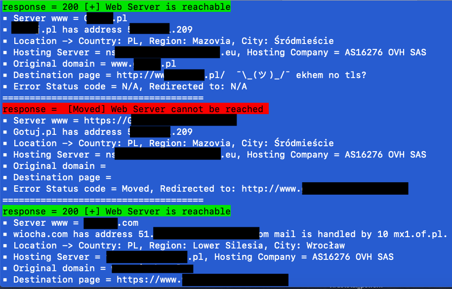

| Another article about Hunting malware with Powershell --> [PS for hunting malware](https://art-ek.github.io/pshell-virusTotal/) | An article about Powershell automation –> [System audit in Powershell](https://art-ek.github.io/SystemAudit/) |

# Bulk GET request script to check HTTP status , redirections, http headers and IP location #

Disclaimer, This is a very early beta version and has been created using .NET core and will only run on *NIX* like systems.
It uses the "host" command which is not on Windows. Soon, will probably add a .NET function to replace it.

Shortly it's a simple powershell script to perform a get request using invoke-webrequest cmdlet.
It has been created to perfom bulk checks for multiple domains. To use it against a simple domain, you might also just use your browser ;)
Script has been optimised and now it will take few minutes not hours, depends how long is your list.
What is this script for anyway?
Well you can use it to check if a specific domain exists, check for a **web server presence** , diagnostics,**OSINT**, **redirections** and more...?
Simply put If you have a list of different domains/subdomains/servers and you would like to check if they host a web server on standard 80 and 443 ports then this script will really speed up your searches.

## ++ features ++
- It will check both **http and https**, you just need to provide a domain name like bbc.co.uk, bing.com, example.com and each domain must be in a new line 
- **web presense** , it will check redirections and show destination page
- Physical locations **IP geo location added. I'm using ipinfo.io API for geo stuff. To get your free auth token please visit this site**
- Easy input, paste as many as you like URLs and check status codes and redirects in one batch
- added burp as a proxy so you can see all the GET requests in burp for further scans....
- script follows redirections (5 by default - can be changed if needed)
- and most important the **user-agent header** will not show powershell as the agent but it will randomly use one of the following (chrome,firefox/safari,IE,opera)
- results will be saved it 4 different files (SCAN.LOG, VALID_DOMAINS.txt, NXDOMAINS.txt, valid_address.txt,invalid_address.txt)

Script has 2 parameters.
- list (Argument for the list parameter will be your previously created file with all domains you want to check)

- local_proxy (Arguments for the local_proxy are $true or $false.)

Usage:
start powershell on linux/mac
To send GET request via local burp proxy
-    Usage: ./get-web-request.ps1 -list your_file_list.txt -local_proxy $true 
-    example: /get-web-request.ps1 -list ./test.txt -local_proxy $true
   
-    To send GET request directly
-    Usage: ./get-web-request.ps1 -list your_file_list.txt -local_proxy $false
-    Example: /get-web-request.ps1 -list ./test.txt -local_proxy $false

   You can change your burp port in the script file. Variable name is:proxy_burp.
   By default proxy listens on port 8080, you can also use any other proxy, does not have to be local proxy if you know what I mean ;)
  
++ Currently working on a function that will show us all redirection steps with full details and HTTP codes.

Example output

Log file created with more specific information

